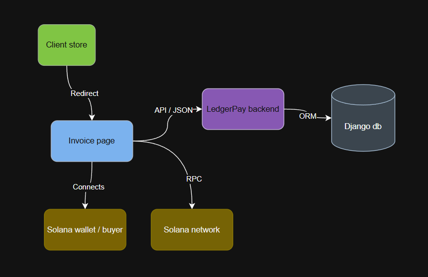
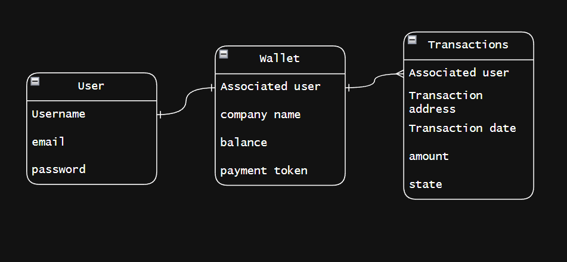
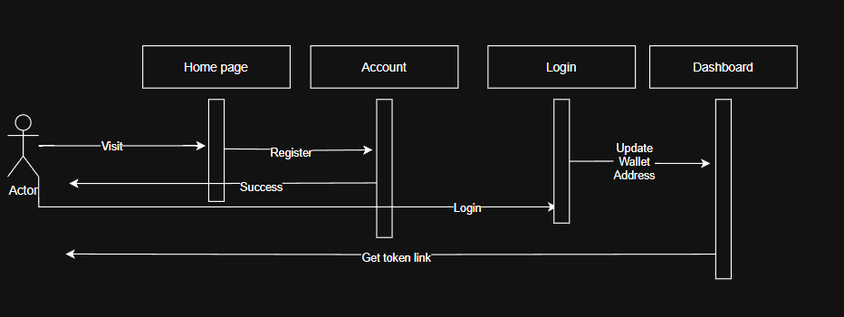

# LedgerPay Architecture

## high-level component diagram:

This high-level component diagram shows the architecture of a payment workflow involving a client store, the LedgerPay system, and the Solana blockchain. A user is redirected from the Client Store to an Invoice Page, which connects to their Solana wallet and the Solana network via RPC. The page also communicates with the LedgerPay backend using a JSON API to handle transactions and database operations.

## Entity diagram

This Entity-Relationship Diagram (ERD) outlines the core database structure for a payment or wallet system. It includes three entities: **User**, **Wallet**, and **Transactions**. Users are linked to wallets, which store payment-related details, and all transactions are associated with a user.

## Call sequence diagram

This sequence diagram shows the interaction between a user and components like Home Page, Account, Login, and Dashboard. The user registers via the Home Page and Account, receives confirmation, and then logs in. After logging in, they update their wallet address in the Dashboard and receive a token link for store use.
