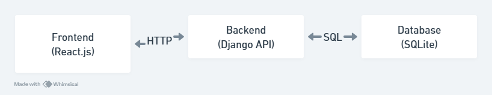
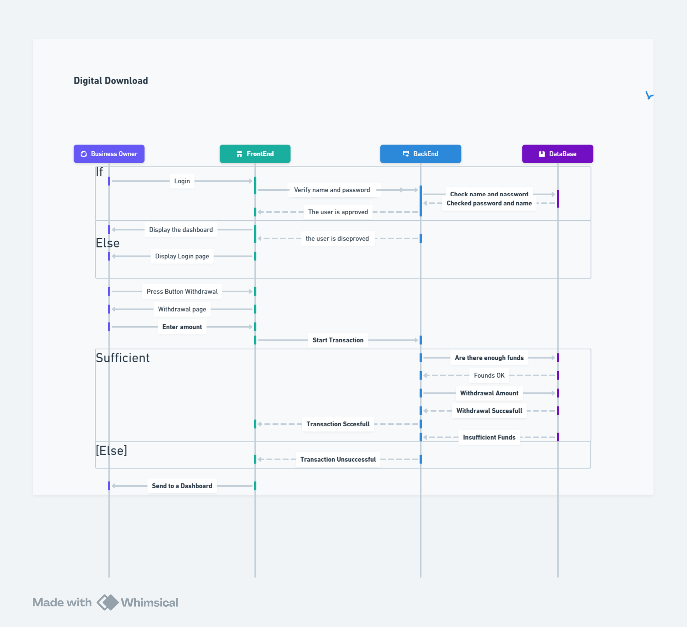
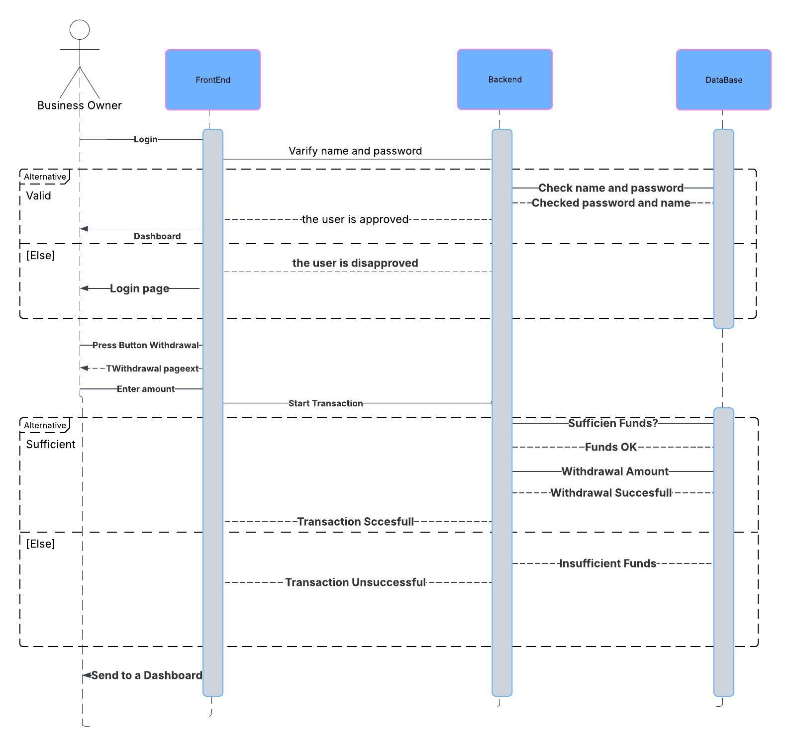

# LedgerPay Architecture

## High-Level Component Diagram

The high-level component diagram illustrates the architecture of LedgerPay, which consists of three main components: the Frontend, Backend, and Database. The Frontend, built with React.js, handles the user interface and communicates with the Backend via HTTP requests. The Backend, a Django API, processes these requests, performs business logic, and interacts with the Database using SQL queries. The Database, implemented with SQLite, stores all application data, such as user information, transactions, and wallet balances.

## Entity Relationship Diagram

The entity relationship diagram models the data structure for LedgerPay's core functionality. The `auth_user` table stores user information (e.g., username, password), linked to `payments_wallet` (user wallets with balances) and `payments_transaction` (transaction records) via foreign keys. The `django_admin_log` tracks administrative actions, while `django_migrations` and `django_session` manage database migrations and user sessions, respectively. Relationships like one-to-many between `auth_user` and `payments_wallet` ensure each user can have multiple wallets, and each wallet can have multiple transactions.

## Call Sequence Diagram

The call sequence diagram depicts the login and withdrawal process in LedgerPay. The Business Owner initiates a login by entering their username and password on the Frontend, which sends a request to the Backend. The Backend verifies the credentials against the Database, returning approval or disapproval. If approved, the user is directed to the dashboard. For a withdrawal, the user presses the "Withdraw" button, enters an amount, and the Backend checks for sufficient funds in the Database. If funds are sufficient, the transaction completes successfully, and the updated balance is reflected on the dashboard; otherwise, the transaction fails, and the user is notified.
