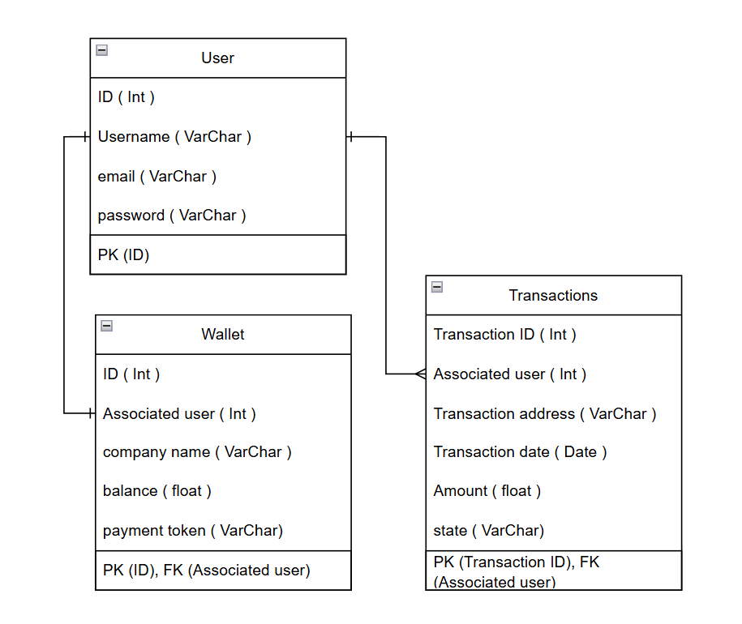

## LedgerPay Architecture

### High-Level Component Diagram

This diagram illustrates the core components of the LedgerPay system and how they interact with 
each other during a transaction. A client store redirects the user to an invoice page, which serves as the payment
interface. The user connects their Solana wallet and signs the transaction, which is then sent to the Solana network via 
an RPC call. The invoice page also communicates with the LedgerPay backend through an API, providing transaction details. 
The backend, built using Django, processes this data and stores it using an ORM in the SQLlite database. This setup 
allows the client to track payments and manage transactions securely from the dashboard.

---
### Entity Diagram

This entity relationship diagram shows the core data model of the LedgerPay system focused on users, wallets, and 
transactions. Each `User` has a unique `Wallet` in a one-to-one relationship. The wallet contains additional information 
such as the company name, balance, and a payment token. 

A `User` can be associated with multiple `Transactions`, establishing a one-to-many relationship between `User` and 
`Transactions`. Each transaction stores data such as the amount, transaction date, address, and its current state. 

---
