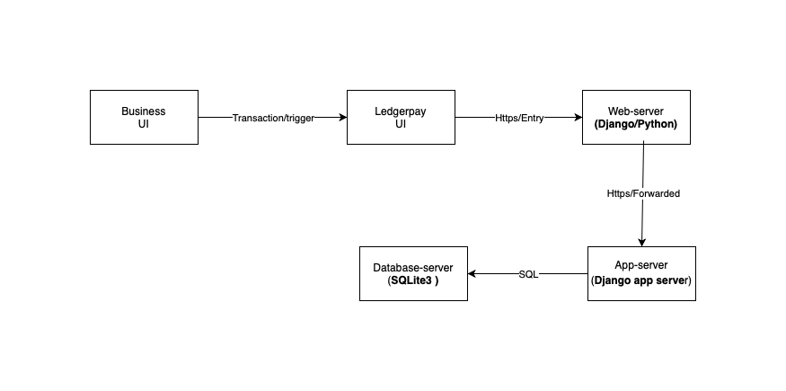
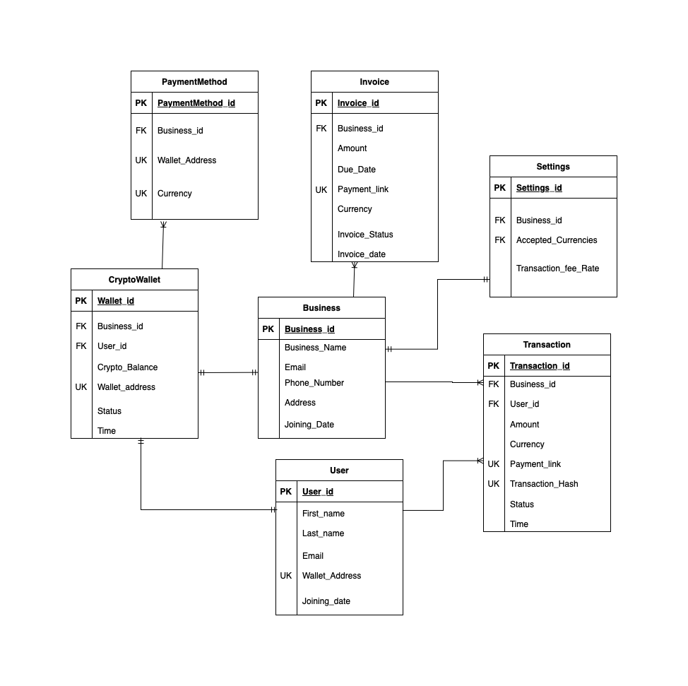
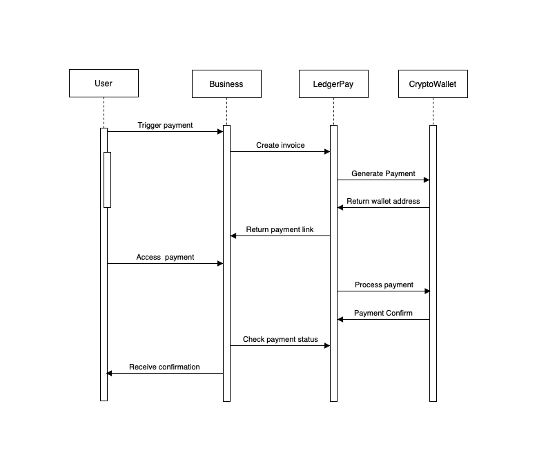

# High Level Component Diagram

- Django Web Server:
Role: 
1- The web server handles incoming HTTP requests from clients and routes them to the appropriate application server
2- The web server also delivers the response back to ledgerpay UI for the business UI (such as HTML, CSS, python component)

- Django App Server:
Role:
1- The app server receive https forwarded request and runs the Django application code and handles the business logic behind HTTP requests, interacting with databases, models, views and other components.

- Sqlite3 Database server:
Role:
1- Role: The database server is responsible for storing, retrieving, and managing the data used by the Django application (e.g., Business information, transaction history etc..)
2- Handles requests for data operations (such as SELECT, INSERT, UPDATE, DELETE sql-queries).

In summary:
The user trigger payment on business client UI leading to ledgerpay UI sending a payment request to the web-server. Then The web server handles incoming HTTP requests and serves static content.
The app server runs the Django application and processes dynamic requests.
The database server manages data and responds to queries made by the Django application.

# Entity Diagram

Entities relationships:

- Business to Transaction:

One-to-Many relationship: One business can have multiple transactions, but each transaction belongs to one business.

- User to Transaction:

One-to-Many relationship: One user can have multiple transactions, but each transaction belongs to a single user.

- Business to Invoice:

One-to-Many relationship: A business can have multiple invoices, but each invoice can be from 1 business only

- Business to CryptoWallet:

One-to-one: each business is allowed one cryptowallet, and each cryptwallet belong to only one business

- User to CryptoWallet:

One-to-one: each user connect one cryptowallet, and each cryptwallet used belong to only one user

- CryptoWallet to PaymentMethod:

one-to-many: each wallet can accept many payment methode (currencies)

- Settings to Business:

One-to-One relationship: Each business will have one set of settings

# Sequence Diagram

The sequence diagram outlines a payment processing workflow involving multiple entities: User, Business, LedgerPay, CryptoWallet.
Here’s a breakdown of how payments are handled in this system

Triggering a Payment: The user initiates a payment to the business.
Create Invoice: The business creates an invoice via LedgerPay.
Generate payment: LedgerPay generates the payment request 
Return wallet address: wallet address are given to ledgerpay from x wallet
Return payment link: Ledgerpay return a payment link via business
Acces payment: User access payment link via business
Process payment: Ledgerpay process payment interacting with crypto wallets
Payment confirm: crypto wallet balance return confirmation if payment received/made to ledgerpay
Checkpayment status: business check via ledgerpay the payment status
Receive confirmation: Business return payment confirmation to user on its UI
